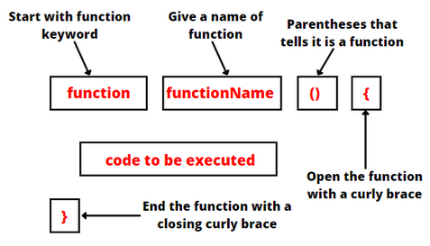
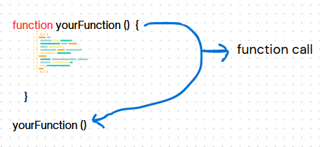
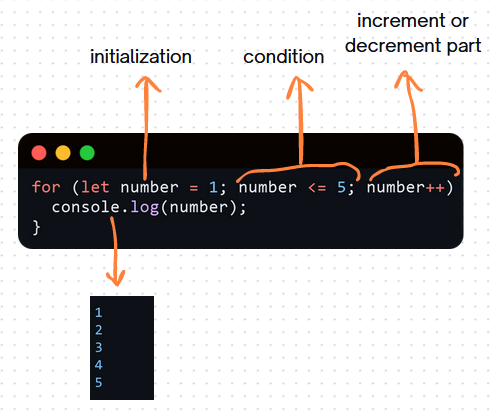
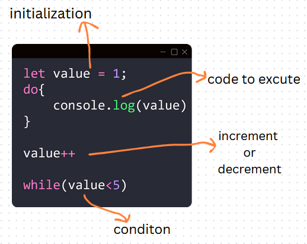

<div align="center">
  
  <h1>JavaScript Questions</h1>
</div>

> [!NOTE]  
> my repo is created with easy basic Js questions for beginners to understnad wht they're learning

---

<p align="center">feel free to reach out to me 😊</p>

<p align="center">
  <a href="#">Instagram</a> || <a href="#">Twitter</a> || <a href="#">LinkedIn</a> || <a href="#">Blog</a>
</p>

</p>
</details>

#### Question 1

Q: What is the correct syntax to print "Hello, World!" in JavaScript?

<details><summary><b>Answer</b></summary>

```js
console.log("Hello, World!");
```

</details>

#### Question 2

Q: How do you create a variable in JavaScript?

<details><summary><b>Answer</b></summary>

```js
let yourVariableName //  its called camlecase formate
var yourVariableName
const yourVariableName
```

> var, let, and const are all used for declaring variables in JavaScript, but they have different scoping, hoisting, and reassignment behaviors. in the modern days var is not recomanded.

</details>

#### Question 3

Q: How do you create a function in JavaScript?

<details><summary><b>Answer<br></summary>

```js
function functioName() {
  //u can use name as it function name
  // your code excute here
}
```



</details>

#### Question 4

Q: How do you call a function in JavaScript?

<details><summary><b>Answer<br></summary>

```js
function yourFunction() {
  // your code excute here
}
yourFunction();
```



</details>

#### Question 5

Q: How do you write an if statement in JavaScript to check if "a" variable "a" is equal to 5?

<details><summary><b>Answer<br></summary>

```js
if (a === 5)
```

</details>

#### Quesiont 6

Q: wht is === mean in js

<details><summary><b>Answer<br></summary>

<p > in JavaScript, the === operator is known as the strict equality operator. It compares two values for equality, considering both the value and the type. This means that === will only return true if the values on both sides of the operator are exactly same in both type and value </p>

</details>

#### Question 6

Q: how do you write a loop that runs 5 times in ?

<details><summary><b>Answer<br></summary>

```js
for (let number = 1; number <= 5; number++) {
  console.log(number);
}
```



</details>

#### Question 7

Q: Write a while loop that prints the numbers from 1 to 5.

<details><summary><b>Answer<br></summary>

```js
let value = 1;
while (value < 5) {
  console.log(value);
  value++;
}
```


</details>

#### Question 8

Q: Write a do...while loop that prints the numbers from 1 to 5.

<details><summary><b>Answer<br></summary>

```js
let value = 1;
do {
  console.log(value);
  value++;
} while (value < 5);
```

</details>
